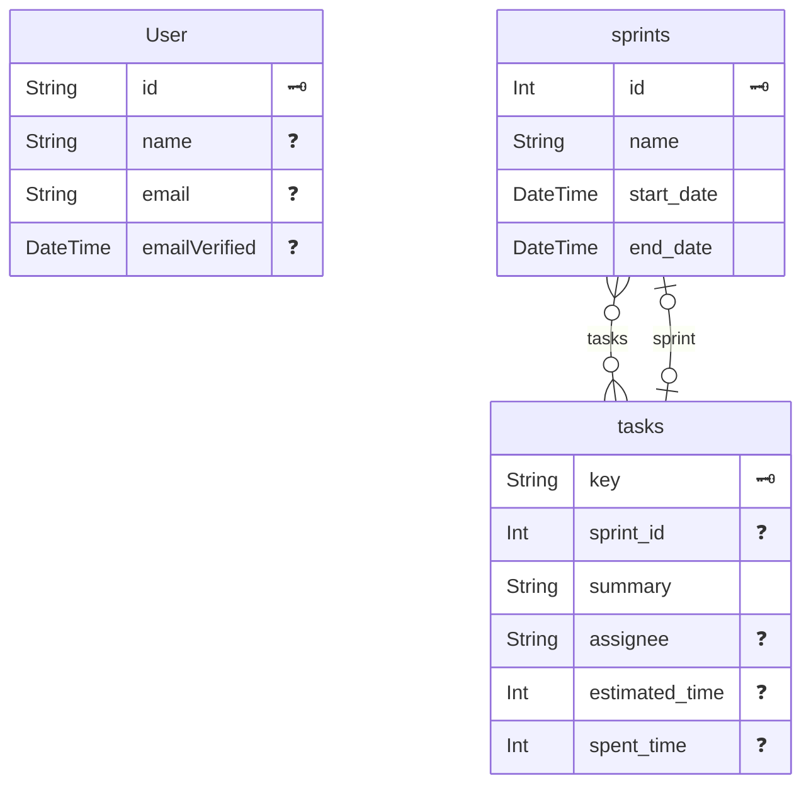

```mermaid
erDiagram

  "User" {
    String id "🗝️"
    String name "❓"
    String email "❓"
    DateTime emailVerified "❓"
    }
  

  "sprints" {
    Int id "🗝️"
    String name 
    DateTime start_date 
    DateTime end_date 
    }
  

  "tasks" {
    String key "🗝️"
    Int sprint_id "❓"
    String summary 
    String assignee "❓"
    Int estimated_time "❓"
    Int spent_time "❓"
    }
  
    "sprints" o{--}o "tasks" : "tasks"
    "tasks" o|--|o "sprints" : "sprint"
```
